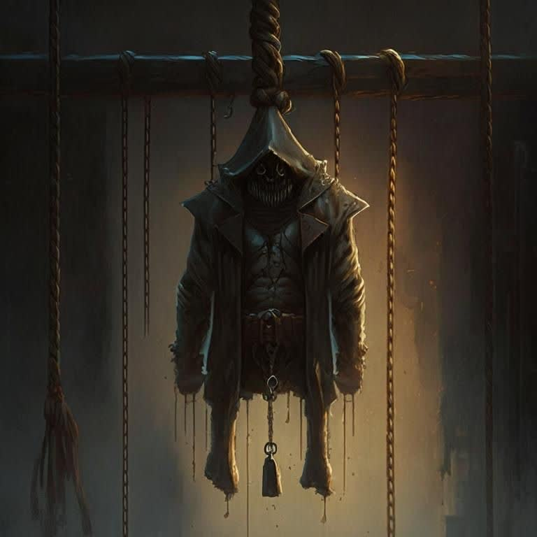

# OXman 4 connect D

## The nostalgia games Hangman and connect 4

# 1- Connect 4 Game

This is a console-based implementation of the Connect game in C#. The game allows two players to take turns placing their markers on a grid. The objective of the game is to connect a specified number of markers in a row, column, or diagonal.

## How to Play
1. Run the program.
2. Enter the names of the two players when prompted.
3. Each player selects a color from the available options.
4. Players take turns choosing a column to place their marker in.
5. The game will display the current state of the grid after each turn.
6. The game continues until one player successfully connects the required number of markers in a row, column, or diagonal.
7. The winner will be announced, and the game ends.
## Game Rules
- Players take turns placing their markers on the grid.
- Players choose a column to place their marker, and it will fall to the lowest available position in that column.
- The game grid is represented by numbers. 0 indicates an empty cell, 1 represents the first player's marker, and 2 represents the second player's marker.
- The game checks for a winning condition after each turn.
- A winning condition is achieved when a player connects the required number of markers (specified by maxNumber) in a row, column, or diagonal.
- If all cells are filled without any winning condition, the game is declared a draw.
## Code Structure
The code is structured into a single class named `Connect`, which handles the game logic and user interface. Let's take a closer look at the different parts of the code:

### `Point` Class
The `Point` class is a nested private class within the `Connect` class. It represents a point in the game grid and is used to store the coordinates of the markers placed by the players. It contains two public fields, `x` and `y`, which represent the row and column indices of a point.

The Point class also overrides the `Equals` and `GetHashCode` methods to enable comparison and hashing of point objects. This allows efficient usage of HashSet<Point> collections to keep track of the markers placed by each player.

### Game State and Variables
The `Connect` class contains several private variables to maintain the state of the game:

- `matrix`: A 2D integer array `int[,]` representing the game grid. It stores the player markers (1 or 2) in the corresponding grid positions.
- `person1` and `person2`: `HashSet<Point>` collections to store the points where each player has placed their markers.
- `h` and `w`: Integer variables representing the height and width of the game grid.
- `maxNumber`: An integer representing the maximum number of markers that need to be connected to win the game.
- `colors`: A string array to store the chosen colors for each player.
- `colorCodes`: A string array containing ANSI escape codes for different colors used in the console output.

### Game Loop and Printing
The main game loop in the `play` method iterates until a winning condition is met. In each iteration, it alternates between the two players, allowing them to choose a column to place their marker. It then updates the game grid and checks for a winning condition using the `check` method.

The `print` method is responsible for printing the current state of the game grid to the console. It uses ANSI escape codes to set the colors of the markers based on the player's chosen colors.

#### Depth-First Search (DFS)
The `DFS` method is a recursive depth-first search algorithm used to check for a winning condition. It starts from a given point and explores the neighboring cells to determine if a connection of markers has been achieved.

The `DFS` method uses a `visited` array to keep track of visited cells and stops the recursion when the required number of connected markers is found. It checks the eight possible directions (up, down, left, right, and diagonals) to find a valid connection.

The `DfsLine` method is a helper method used by `DFS` to check for a valid connection in a specific direction. It checks if the next cell in the given direction contains a marker of the same player and continues the connection check until the required number of markers is reached.

# 2- The Hangman
 
This is a console-based implementation of the Hangman game in C#. The game allows a player to guess letters in a secret word within a limited number of attempts.
## Game Rules
The Hangman game follows these rules:

1. The game starts with the entering a secret word into the match by host and people won't see the hidden word because of the printing star on the console.
2. The player's objective is to guess the letters of the secret word before running out of attempts.
3. The number of remaining guesses is determined by the length of the secret word. It is calculated as secretWord.Length / 5 + 6.
4. At each turn, the player is prompted to guess a letter.
5. The guessed letters are case-insensitive, meaning uppercase and lowercase letters are considered the same.
6. If the guessed letter is present in the secret word, it is considered correct, and the letter is revealed in the word.
7. If the guessed letter is not in the secret word, it is considered incorrect, and a part of the hangman is drawn on the console.
8. The hangman is drawn incrementally with each incorrect guess until it is fully drawn.
9. The game ends in victory if the player correctly guesses all the letters in the secret word.
10. The game ends in defeat if the player runs out of guesses before guessing the word.
11. After the game ends, the player is informed of the outcome and the actual secret word.

## Code Structure
The code is structured into a single class named `Hangman`, which handles the game logic and user interface. Let's take a closer look at the different parts of the code:

### Game Initialization
The `Play` method serves as the entry point of the game. It starts by getting a secret word using the `GetRandomWord` method. The player is prompted to enter the secret word, which is hidden as asterisks on the console. The length of the secret word determines the number of remaining guesses and the step size for drawing the hangman.

### Masked Word Display
The `GetMaskedWord` method displays the masked word on the console, showing guessed letters in green and unknown letters as underscores in purple. It takes the secret word and a set of guessed letters as parameters and iterates through each character, applying the appropriate color formatting.

### Guessing and Validation
The player is prompted to guess a letter by entering it on the console. The input is read using `Console.ReadLine()` and converted to lowercase. If the input is empty or invalid, an exception is thrown and caught, and the player is prompted again for a valid guess.

### Guessed Letters and Word Completion
The guessed letters are stored in a `HashSet<char>` named `guessedLetters`. Each valid guess is added to this set. The game checks if the guessed letter is present in the secret word. If it is, the letter is considered correct, and the game checks if all the letters in the secret word have been guessed. If so, the player wins the game.

### Hangman Drawing
The hangman is drawn using the `DrawHangman` method. It appends a portion of the `wordlist` string to the `hangman` string based on the step size and the current progress of the game. The hangman string is displayed on the console after an incorrect guess.

### Game Over
If the player runs out of guesses before guessing the word, the game ends in defeat. The hangman is fully drawn on the console, and a message is displayed, revealing the secret word.
# Dependencies
- This game requires a console application to run.
- The console must support ANSI escape codes to display colored text.